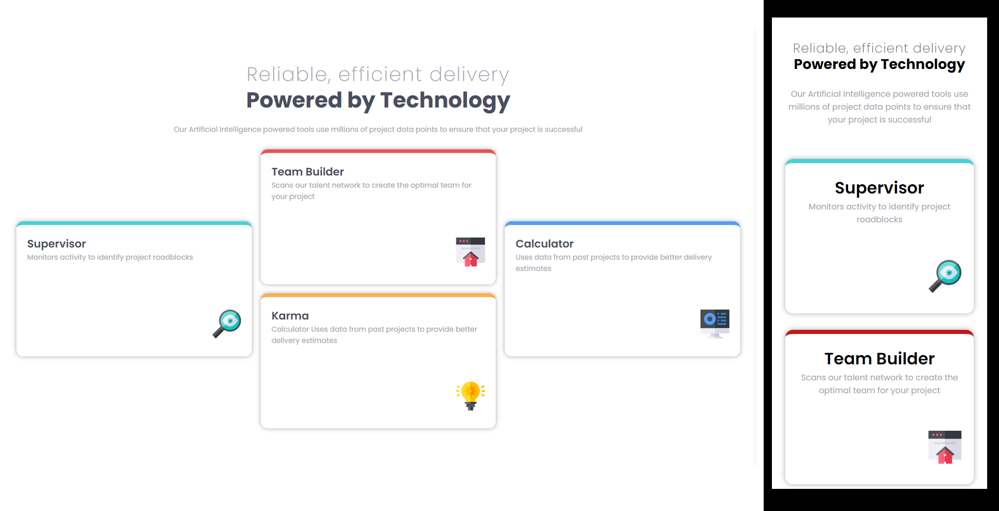

# Frontend Mentor - QR code component solution

This is a solution to the [QR code component challenge on Frontend Mentor](https://www.frontendmentor.io/challenges/qr-code-component-iux_sIO_H). Frontend Mentor challenges help you improve your coding skills by building realistic projects.

## Table of contents

- [Overview](#overview)
  - [Screenshot](#screenshot)
  - [Links](#links)
- [My process](#my-process)
  - [Built with](#built-with)
  - [What I learned](#what-i-learned)
  - [Continued development](#continued-development)
  - [Useful resources](#useful-resources)
- [Author](#author)
- [Acknowledgments](#acknowledgments)

**Note: Delete this note and update the table of contents based on what sections you keep.**

## Overview

### Screenshot



### Links

- Solution URL: (https://github.com/Frontend-Mentorr/Product-preview-card-component-HTML-CSS-Responsive)
- Live Site URL: (https://frontend-mentorr.github.io/Product-preview-card-component-HTML-CSS-Responsive/)

## My process

### Built with

- Semantic HTML5 markup
- CSS custom properties
- Flexbox
- Mobile-first workflow

### What I learned

Working with CSS Grid & MediaQueries

```css
@media (min-width: 450px) {
  .sectionContainer {
    width: 100%;
    max-width: 1400px; /* This should be the max-width of the section container if needed */
    margin: 0 auto; /* This centers the .sectionContainer */
  }

  .gridContainer {
    width: 100%;
    display: grid;
    grid-template-columns: 1fr 1fr 1fr; /* Three equal columns */
    grid-auto-rows: minmax(
      300px,
      auto
    ); /* Sets the minimum and maximum height for all auto-generated grid rows.
    Each row will be at least 300px tall and will grow as needed to fit the content. */
    gap: 20px; /* Adjust the gap between grid items */
    align-items: start; /* Aligns all items to the start of their respective rows */
  }

  .card1 {
    grid-column: 1;
    align-self: center; /* Vertically centers Card 4 in the third column */
  }

  .card2 {
    grid-column: 2;
    grid-row: 1; /* Card 2 in the first row of the second column */
  }

  .card3 {
    grid-column: 2;
    grid-row: 2; /* Card 3 in the second row of the second column */
  }

  .card4 {
    grid-column: 3;
    align-self: center; /* Vertically centers Card 4 in the third column */
  }

  .card {
    width: 100%; /*this needs to be 100% to be able to be centered horizontally*/
  }

  /*-------This next code extends the element to cover two grid rows. This is useful for vertically centering
   or giving more space to an item in a grid layout. 'auto' starts the span at the next available row.
   This CSS rule means that any element with the class .span-row will occupy two rows in the grid. The auto part indicates that the spanning should start at the row where the element would naturally be placed based on the flow of the document and grid placement rules. The span 2 part tells the grid layout that the element should span across two rows starting from where it begins. This is particularly useful for creating layouts where certain elements need to stand out by covering more vertical space. Thanks to the fixed height the card doesn't stretched.------- */

  .span-row {
    grid-row: auto / span 2;
  }

```

### Continued development

I would like to continue studying responsive CSS specially with Grid + Flexbox and Css animation, transitions and FX like parallax.

### Useful resources

- [web.dev](https://web.dev/learn/css) - This helped me for get back on track with CSS.
- [w3schools](https://www.w3schools.com/css/default.asp) - The one place to refresh stuff in practical way.

## Author

- Website - [Junier Bolivar](https://www.bolivarcreativedesign.com)
- Frontend Mentor - [Junbol](https://www.frontendmentor.io/profile/Junbol)
- Twitter - [@JunierBolivar](https://www.twitter.com/@JunierBolivar)

## Acknowledgments
